<!-- markdownlint-disable MD033 MD041 -->
 

  

  <h3 align="center">Gouel</h3>

  

    La solution de gestion d'événements tout en un
     
    
La solution n'est pas encore finie. Elle n'est pas opérationnelle pour de la mise en production

     
    <a href="https://github.com/gouel/GouelMonoRepo/blob/main/Docs/index.md"><strong>Documentation</strong></a>
     
     
    <a href="https://github.com/gouel/GouelMonoRepo/issues">Demander une fonctionnalité</a>
  

   

## Table de matières

1. [Table de matières](#table-de-mati%C3%A8res)
2. [À propos](#%C3%A0-propos)
   1. [Captures d'écrans](#captures-d%C3%A9crans)
3. [Technologies](#technologies)
4. [Installer Gouel](#installer-gouel)
   1. [Prérequis](#pr%C3%A9requis)
   2. [Installation](#installation)
5. [Utilisation](#utilisation)
6. [Feuille de route](#feuille-de-route)
7. [Contribuer](#contribuer)
   1. [Développer une fonctionnalité](#d%C3%A9velopper-une-fonctionnalit%C3%A9)
8. [License](#license)
9. [Auteurs](#auteurs)
10. [Remerciements](#remerciements)

## À propos

### Captures d'écrans

WIP

#### GouelApp

##### Page de connexion

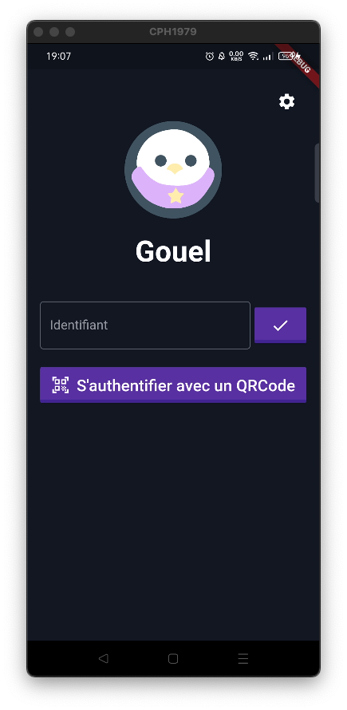

##### Page choix de l'événement

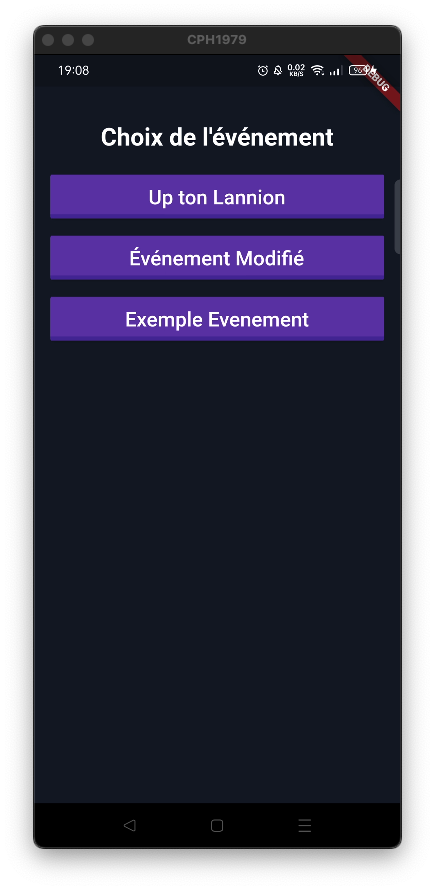

##### Page d'accueil de l’événement

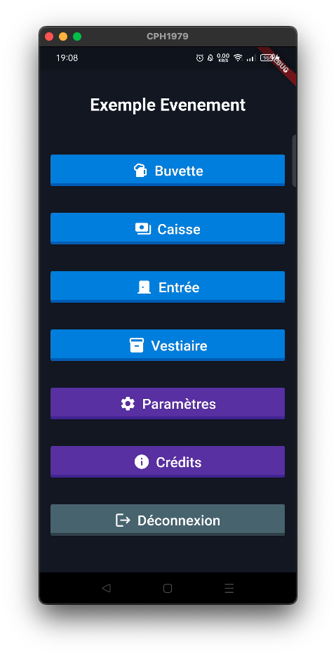

##### Page Caisse

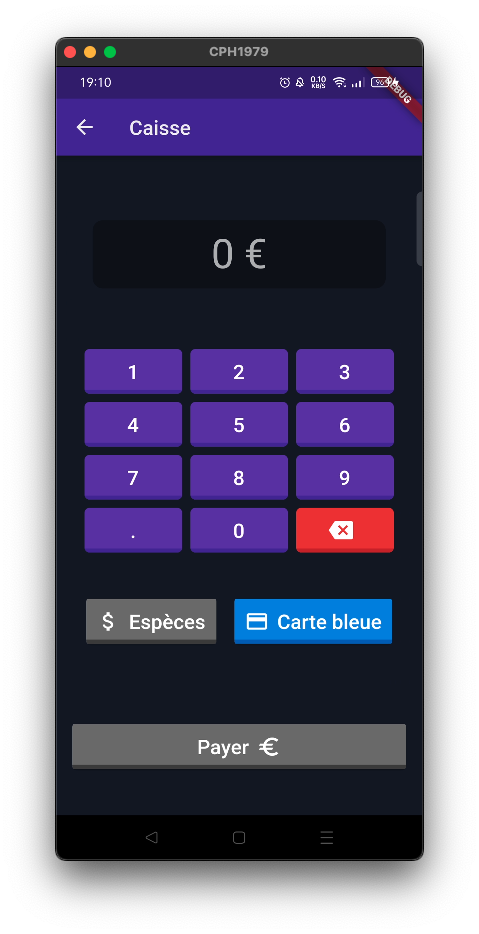

##### Page Entrée

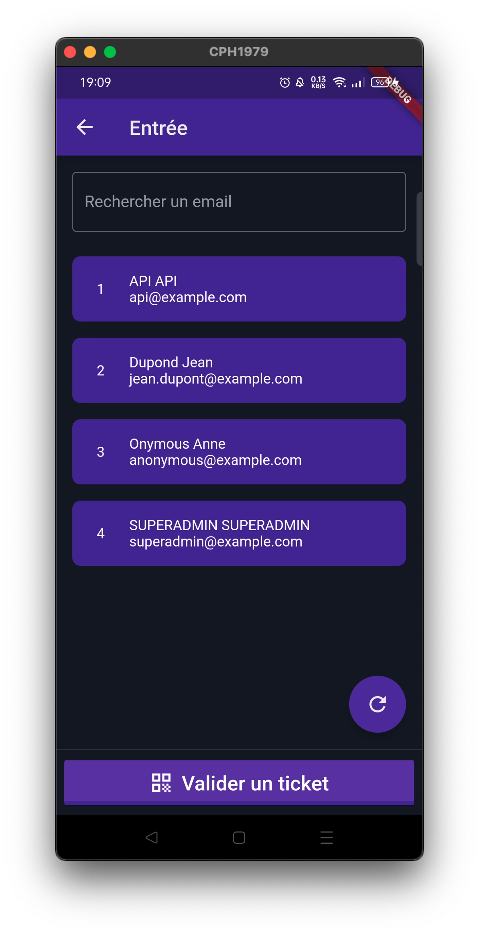
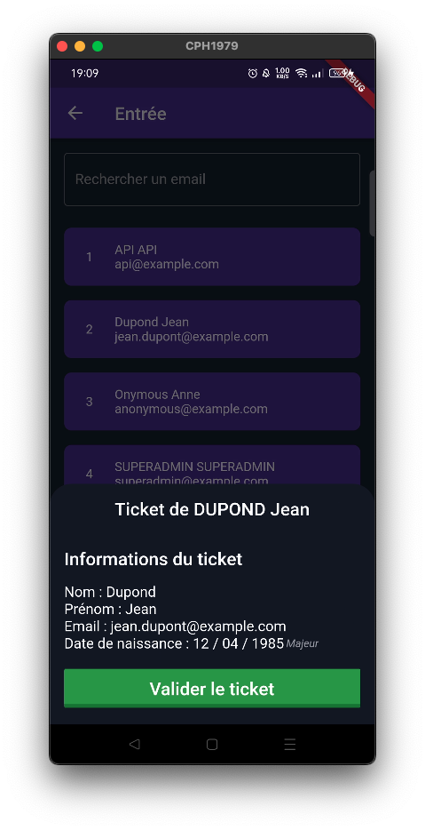
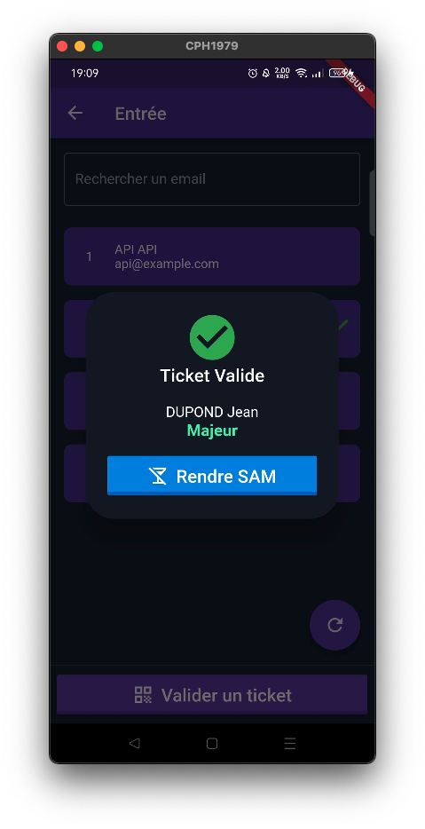

##### Page Vestiaire

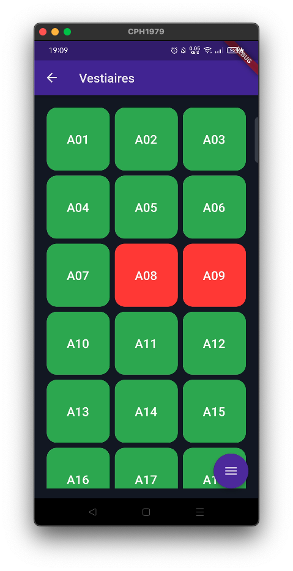
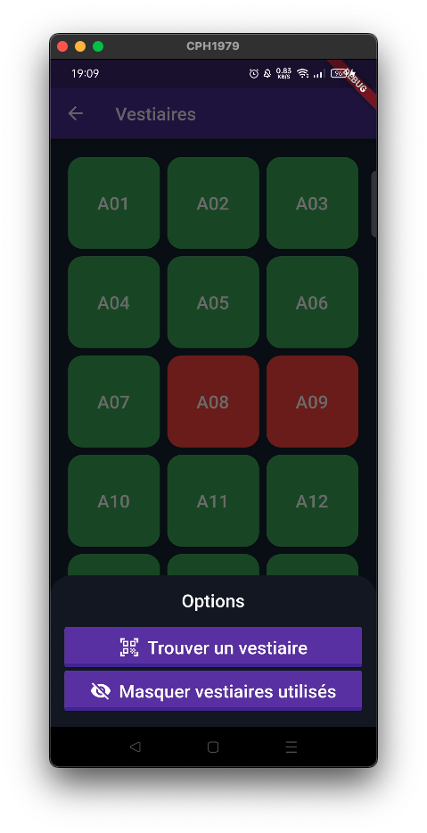

#### GouelFront

##### Page accueil

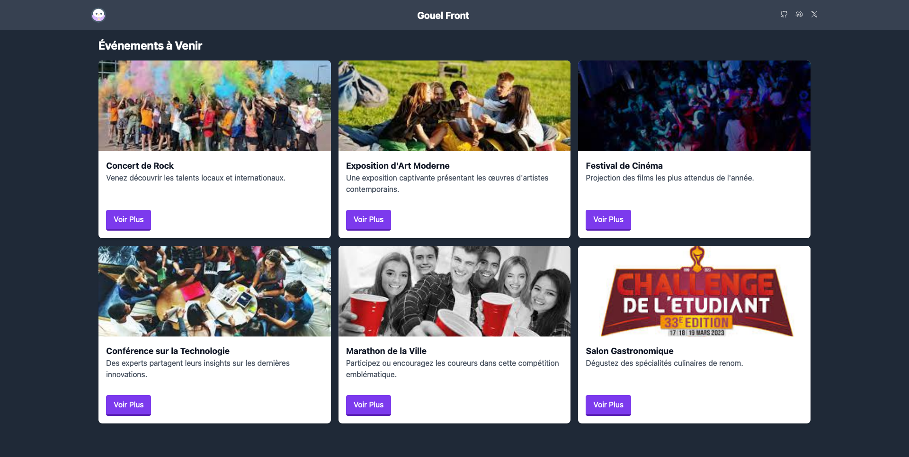

##### Page choix billets

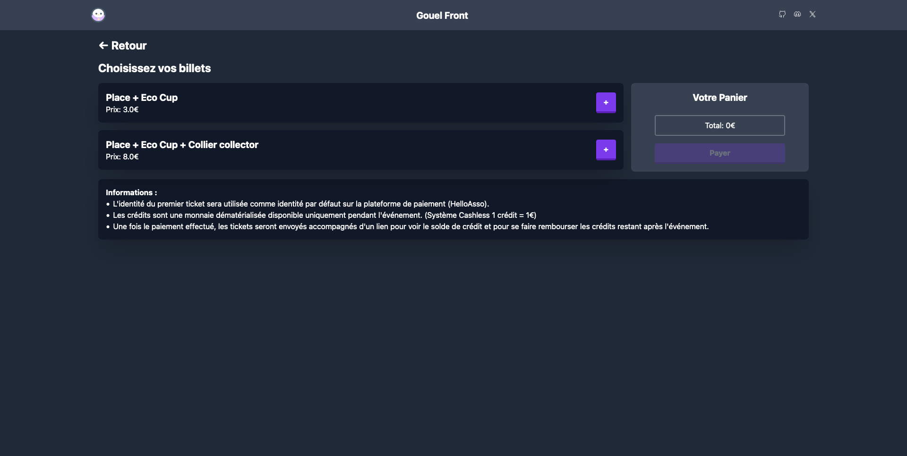

##### Page Admin

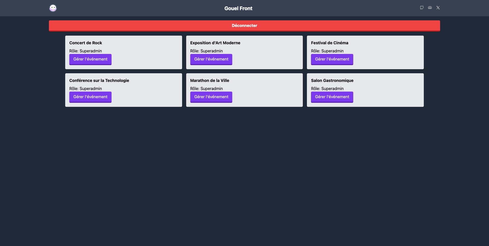

##### Page gestion événement

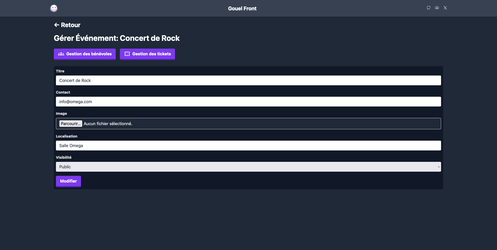

##### Page gestion bénévoles

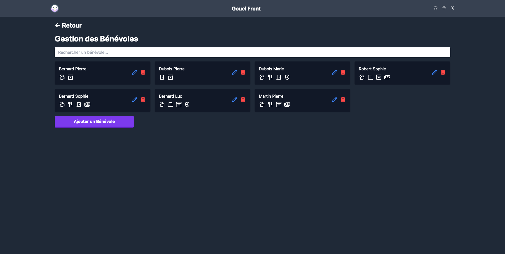

##### Page gestion tickets

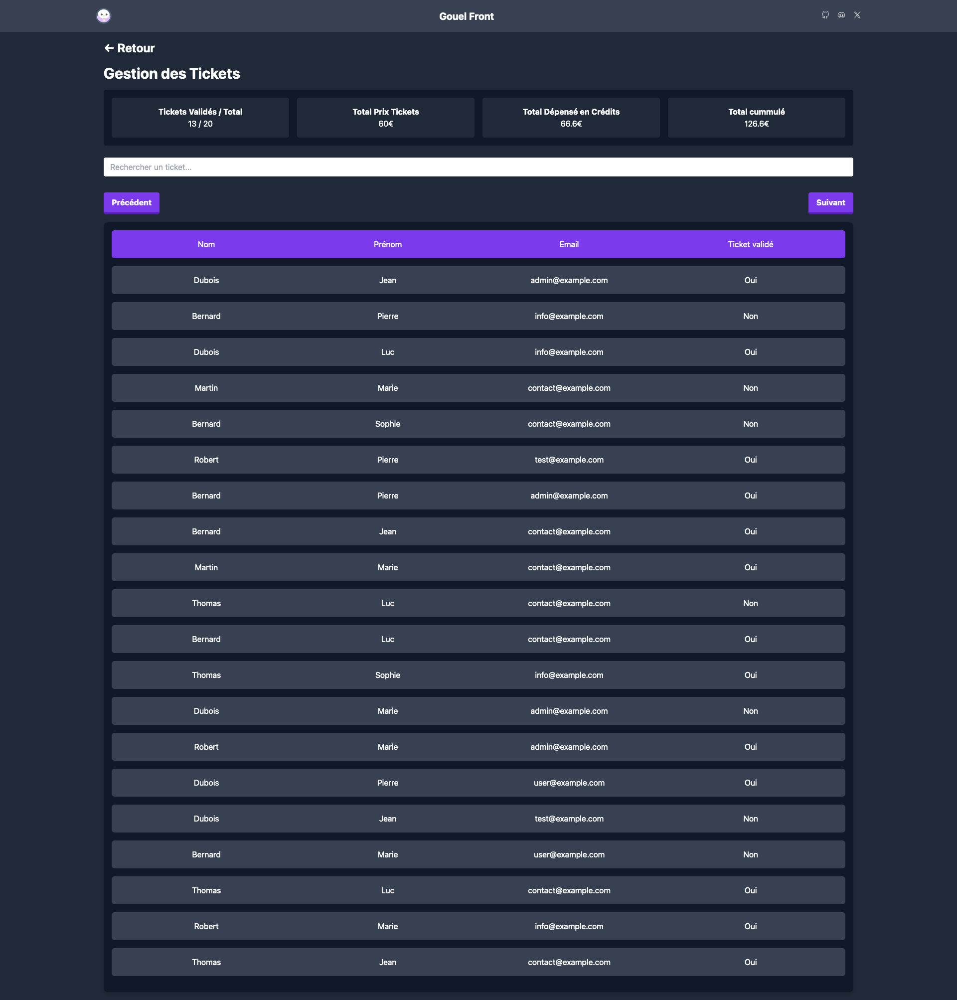

## Technologies

WIP

## Installer Gouel

WIP

### Prérequis

WIP

### Installation

WIP

## Utilisation

WIP

## Feuille de route

WIP

## Contribuer

WIP

### Développer une fonctionnalité

WIP

## License

Distribué sous la licence [MIT](https://github.com/gouel/GouelMonoRepo/blob/main/LICENSE).

## Auteurs

* **Matthias Hartmann** - *Développeur fullstack* - [Iziram](https://github.com/Iziram) - *Création de la solution*

## Remerciements

* [ShaanCoding - ReadMe Generator](https://github.com/ShaanCoding/ReadME-Generator)
